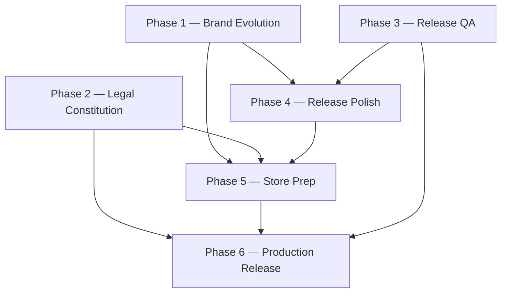

# LeylekTAG Release Roadmap

**Version:** Release Roadmap v1.0  
**Status:** Master program plan — design-lab  
**Date:** 2026-06-21  
**Horizon:** Public Release (Phase 6)  
**North Star:** `brand-dna/v4/NORTH_STAR.md`

---

## Executive summary

LeylekTAG yayın programı **6 fazdan** oluşur. Her fazın tek bir çıkış tanımı vardır; sonraki faza geçiş **gate onayı** ile yapılır. Fazlar sıralıdır; Phase 1 tamamlanmadan Phase 5 store paketi anlamlı değildir.

```
Phase 1  Brand Evolution System     →  Tek tutarlı marka kimliği
Phase 2  Legal Constitution System   →  Single Source of Truth hukuk
Phase 3  Release Quality Assurance   →  Release Candidate (RC)
Phase 4  Release Polish              →  Production Ready UI
Phase 5  Store Release Preparation  →  Store Submission Ready
Phase 6  Production Release          →  LeylekTAG Public Release
```

**Kural:** Production kod/asset değişikliği yalnızca ilgili faz gate'i geçildikten sonra; Phase 1–2 öncelikle design-lab spec + onay.

---

## Phase dependency graph



| Bağımlılık | Açıklama |
|------------|----------|
| P1 → P4, P5 | Marka genomu olmadan polish ve store asset tutarsız kalır |
| P2 → P5, P6 | Store privacy links ve canlı hukuk metinleri SSOT gerektirir |
| P3 → P4, P6 | RC olmadan polish ve release riskli |
| P4 → P5 | UI polish olmadan screenshot/video yanıltıcı olur |
| P5 → P6 | Submission ready olmadan production release yapılmaz |

---

## Phase 1 — Brand Evolution System

### Amaç

LeylekTAG marka kimliğini profesyonel seviyeye çıkarmak — **rebrand değil, logo evolution**.

### İçerik

| Alan | Kapsam | Design-lab referans | Durum |
|------|--------|---------------------|-------|
| **Logo Evolution** | Mevcut premium kuş + arc evrimi; F1 ship yok | `brand-dna/v4/logo-evolution/` | P1 analiz ✅ |
| **Marker System** | Harita pinleri, trust/QM overlay, shared genom | `MARKER_DNA.md`, `markers/constitution.md` | Spec ✅ / asset ☐ |
| **LHIS Branding** | Login, splash, auth chrome, cockpit | `premiumAuthStyles`, `LoginBrandHeader` | Production partial |
| **LSX Integration** | Motion + haptic + sonic triad | `lsx/LSX_*` | Spec ✅ / wire partial |
| **Motion DNA** | presence, lock, relay tokens | `MOTION_DNA.md`, `LSX_MOTION_LANGUAGE.md` | Spec ✅ |
| **Sonic DNA** | LSDS v2 genome, boot/QR/match | `sonic/v2/`, `SONIC_DNA.md` | WAV v2 ✅ / v3 ☐ |
| **Haptic DNA** | Tier A/B/C, lock sync | `HAPTIC_DNA.md`, `LSX_HAPTIC_LANGUAGE.md` | Spec ✅ / wire gap |
| **Website Brand** | Navbar, hero, OG, favicon unify | `WEBSITE_DNA.md`, `PRODUCTION_LOGO_AUDIT.md` | Audit ✅ / fix ☐ |
| **Cross Platform Brand** | iOS, Android, web, watch, widget | `CROSS_PLATFORM_DNA.md` | Spec ✅ |
| **Master Brand Genome** | Constitution + token export | `BRAND_CONSTITUTION_V4.md`, `exports/genom.tokens.css` | Spec ✅ |

### Alt program: Logo Evolution (P1–P8)

Logo Evolution Phase 1 analizi tamamlandı. Master plan:

| Alt faz | Ad | Çıktı |
|---------|-----|-------|
| P1 | DNA Freeze | Constitution, audit, checklist ✅ |
| P2 | Geometry Evolution | Master SVG trace (design-lab) |
| P3 | Premium Polish | Flat/restraint, renk genom |
| P4 | Micro Icon | M0/M1 tier 16–32 px |
| P5 | App Icon | iOS = Android unify |
| P6 | Motion Integration | LSX + ring close |
| P7 | QA | Blind tanınırlık ≥85% |
| P8 | Production Migration | Asset swap |

Detay: `brand-dna/v4/logo-evolution/EVOLUTION_ROADMAP.md`

### Alt program: Brand DNA v4 (Faz 0–5)

| v4 Faz | Karşılık | Not |
|--------|----------|-----|
| Faz 0 Spec | Phase 1 spec layer | 15 belge ✅ |
| Faz 1 Stakeholder | Phase 1 gate | Onay bekliyor |
| Faz 2 Asset Lab | Phase 1 + P2–P5 logo | design-lab exports |
| Faz 3 Integration | LSX orchestrator spec | Phase 1 çıkış |
| Faz 4 Production PR | Phase 4 polish öncesi brand wire | Ayrı PR'lar |
| Faz 5 Platform | Post-release genişleme | Watch, widget |

Detay: `brand-dna/v4/ROADMAP.md`

### Phase 1 çıkış kriterleri (gate)

| # | Kriter | Doğrulama |
|---|--------|-----------|
| 1 | Logo Evolution P1 DNA Freeze onaylandı | Stakeholder sign-off |
| 2 | Tek logo ailesi stratejisi onaylandı (premium kuş canonical) | Constitution |
| 3 | Renk genom `#00D4AA` + void/slate unify spec | genom.tokens |
| 4 | Marker + logo shared stroke spec | LOGO_MARKER_SHARED_GENOM |
| 5 | LSX triad token map tam | LSX_EVENT_MATRIX |
| 6 | Sonic v2 kazananlar + v3 gap listesi | LSDS listening |
| 7 | Website brand audit P0 listesi kapatma planı | PRODUCTION_LOGO_AUDIT |
| 8 | Master Brand Genome export paketi | CSS + manifest |

### Phase 1 çıkış

> **Tek ve tutarlı marka kimliği** — spec + design-lab asset + production migration planı onaylı; kullanıcı tüm yüzeylerde aynı LeylekTAG algısı.

---

## Phase 2 — Legal Constitution System

### Amaç

Türkiye yasalarına tam uyumlu profesyonel hukuk altyapısı — **Single Source of Truth (SSOT)**.

### İçerik

| Belge | SSOT hedef | Mevcut durum (repo) |
|-------|------------|---------------------|
| Legal Constitution | Ana anayasa | ☐ Yok — oluşturulacak |
| KVKK | Aydınlatma metni | `website/app/kvkk/`, `legal-content.ts`, backend templates — **parçalı** |
| Açık Rıza | Rıza metinleri | ☐ App/website SSOT yok |
| Gizlilik Politikası | Privacy policy | `website/app/privacy/`, `legal-content.ts`, `privacy-policy-locales.ts` |
| Kullanıcı Sözleşmesi | Terms of use | `website/app/kullanim-sartlari/`, `legal-content.ts` |
| Sürücü Sözleşmesi | Driver agreement | ☐ Eksik / dağınık |
| Güven Ağı Sözleşmesi | Trust network | ☐ Eksik |
| Sürücülerim (Trusted Direct) | Trusted direct terms | ☐ Eksik |
| QR Kullanım Kuralları | QR boarding rules | ☐ Eksik |
| Güven Al / Güven Ver | Trust give/take | ☐ Eksik |
| Yolculuk Kuralları | Trip rules | ☐ Eksik |
| Topluluk Kuralları | Community guidelines | ☐ Eksik |
| Çerez Politikası | Cookie policy | ☐ Eksik |
| Veri Saklama | Retention policy | KVKK içinde kısmi |
| Veri İmha | Deletion/destruction | `hesap-silme` kısmi |
| KVKK Başvuru | Application procedure | KVKK içinde kısmi |
| Abonelik Şartları | Subscription terms | ☐ Eksik |
| İptal / İade Politikası | Cancel/refund | ☐ Eksik |

### Mevcut parçalanma sorunu

| Kaynak | Konum | Risk |
|--------|-------|------|
| Website Next.js | `website/lib/legal-content.ts`, `privacy-policy-locales.ts` | App ile metin drift |
| Mobile | `frontend/components/LegalPages.tsx`, `KVKKComponents.tsx` | Duplicate content |
| Backend legacy | `backend/templates/*.html` | Eski HTML, static logo |
| Static mirror | `website_files/*.html` | Stale |

### Phase 2 alt faz önerisi

| Alt faz | Aktivite |
|---------|----------|
| P2-L0 | Legal Constitution + SSOT schema |
| P2-L1 | Mevcut metin envanter + gap analizi |
| P2-L2 | KVKK + Gizlilik + Kullanım SSOT draft |
| P2-L3 | Sürücü / Güven / QR / Topluluk belgeleri |
| P2-L4 | Çerez, saklama, imha, başvuru |
| P2-L5 | App + website + backend tek kaynak wire |
| P2-L6 | Hukuk review gate |

### Phase 2 çıkış kriterleri

| # | Kriter |
|---|--------|
| 1 | `design-lab/legal/` SSOT — tüm belgeler tek klasör |
| 2 | App, website, store privacy URL aynı metin |
| 3 | KVKK + açık rıza akışı dokümante |
| 4 | Sürücü + yolcu sözleşmeleri ayrı ve tam |
| 5 | QR + güven ağı kuralları ürün akışına map |
| 6 | Hukuk danışmanı onayı |

### Phase 2 çıkış

> **Tek kaynak (Single Source of Truth) hukuk sistemi**

---

## Phase 3 — Release Quality Assurance

### Amaç

Uygulamayı yayın öncesi **sıfır kritik hata** seviyesine getirmek.

### İçerik

| Alan | Kapsam |
|------|--------|
| End-to-End Test | Yolcu + sürücü tam yolculuk |
| Functional QA | Teklif, eşleşme, QR, ödeme, profil |
| UX QA | LHIS, harita, modal, onboarding |
| Performance QA | Cold start, harita FPS, memory |
| Security QA | Auth, token, API, veri sızıntısı |
| Crash QA | Android Hermes, iOS release |
| Socket QA | Realtime offer, match, disconnect |
| Payment QA | Ödeme akışı, edge case |
| QR QA | Boarding scan, timeout, retry |
| Trust QA | Trusted Direct, güven ağı |
| Multi-device QA | Phone, tablet, OS versiyon matrisi |

### Phase 3 çıkış kriterleri

| Severity | Kural |
|----------|-------|
| P0 crash | 0 açık |
| P0 functional | 0 açık (QR, payment, match) |
| P1 UX | Planlı fix veya RC exception log |
| Security | 0 critical |

### Phase 3 çıkış

> **Release Candidate (RC)** — build numarası sabitlenmiş, QA sign-off.

---

## Phase 4 — Release Polish

### Amaç

Tüm kullanıcı deneyimini **premium seviyeye** çıkarmak.

### İçerik

| Alan | Phase 1 bağlantısı |
|------|-------------------|
| UI Polish | LHIS, cockpit, card chrome |
| Animation Polish | LSX motion tokens |
| Motion Polish | presence, lock, relay |
| Typography | Wordmark + UI scale |
| Iconography | Logo tier + system icons |
| Empty States | Brand voice + LeylekEye |
| Loading States | Skeleton, LeylekEye |
| Error States | Restraint, sonic error token |
| Accessibility | WCAG, reduce motion |
| Sound Polish | LSDS v2/v3 final |
| Haptic Polish | LSX haptic wire gap kapatma |
| Visual Consistency | Cross-surface genom audit |

### Phase 4 çıkış kriterleri

| # | Kriter |
|---|--------|
| 1 | Phase 1 brand genom production'da wire |
| 2 | Logo/platform tutarsızlık P0 kapatıldı |
| 3 | Empty/loading/error state catalog |
| 4 | Accessibility audit pass |
| 5 | Visual consistency checklist pass |

### Phase 4 çıkış

> **Production Ready UI**

---

## Phase 5 — Store Release Preparation

### Amaç

Google Play ve App Store yayın paketlerini eksiksiz hazırlamak.

### İçerik

| Alan | Not |
|------|-----|
| Android Release | AAB, signing, versionCode |
| iOS Release | Archive, TestFlight, buildNumber |
| Store Assets | Phase 1 logo tier kullanılır |
| Screenshots | Phase 4 polished UI |
| Feature Graphic | Logo evolution lockup |
| Preview Video | Opsiyonel |
| Store Metadata | TR + EN |
| Keywords | ASO |
| Privacy Links | Phase 2 SSOT URL |
| Support Links | info@, telefon |
| Release Notes | RC changelog |

### Phase 5 çıkış kriterleri

| # | Kriter |
|---|--------|
| 1 | Play Console + App Store Connect draft complete |
| 2 | Privacy policy URL live (Phase 2) |
| 3 | Screenshots = production UI (Phase 4) |
| 4 | Feature graphic = Phase 1 brand |
| 5 | Internal Test / TestFlight green |

### Phase 5 çıkış

> **Store Submission Ready**

---

## Phase 6 — Production Release

### Amaç

LeylekTAG'ın resmi canlı sürümünü yayınlamak.

### İçerik

| Alan | Kapsam |
|------|--------|
| Android Production | Play staged rollout |
| iOS Production | App Store release |
| Website Production | leylektag.com sync |
| Final Verification | Smoke test prod |
| Monitoring | Crash, analytics, socket |
| Post Release Validation | 24h / 7d review |

### Phase 6 çıkış kriterleri

| # | Kriter |
|---|--------|
| 1 | Store live both platforms |
| 2 | Website legal + brand SSOT live |
| 3 | P0 monitoring green 24h |
| 4 | Post-release validation checklist |

### Phase 6 çıkış

> **LeylekTAG Public Release**

---

## Master timeline (öneri)

| Phase | Süre tahmini | Paralel |
|-------|--------------|---------|
| Phase 1 | 8–12 hafta | Logo P2–P8 + sonic/marker lab |
| Phase 2 | 4–6 hafta | Phase 1 P2–P3 ile overlap mümkün |
| Phase 3 | 2–4 hafta | Phase 4 prep |
| Phase 4 | 3–5 hafta | Phase 1 P8 migration |
| Phase 5 | 1–2 hafta | — |
| Phase 6 | 1 hafta | — |

**Toplam:** ~4–6 ay program (ekip kapasitesine göre).

---

## Document index

| Phase | Primary docs |
|-------|--------------|
| 1 | `brand-dna/v4/`, `logo-evolution/`, `lsx/`, `sonic/`, `markers/` |
| 2 | `design-lab/legal/` (oluşturulacak), `website/lib/legal-content.ts` |
| 3 | QA runbook (oluşturulacak) |
| 4 | LSX + LDS + UI polish spec |
| 5 | Store checklist (oluşturulacak) |
| 6 | Release runbook (oluşturulacak) |

---

## Current status snapshot (2026-06-21)

| Phase | Progress | Blocker |
|-------|----------|---------|
| **Phase 1** | Logo Evolution P1 ✅; Brand DNA v4 spec ✅ | Stakeholder DNA freeze; asset lab |
| **Phase 2** | Parçalı legal metinler mevcut | SSOT yok |
| **Phase 3** | — | Phase 1–2 incomplete |
| **Phase 4** | LHIS partial production | Brand unify |
| **Phase 5** | Store assets partial | Brand + legal |
| **Phase 6** | — | All prior phases |

---

## Governance

| Karar | Owner |
|-------|-------|
| Phase gate onay | Product + Brand + Legal (P2) |
| Logo evolution amendment | Chief Brand Architect |
| Legal SSOT amendment | Legal counsel |
| RC sign-off | QA + Engineering |
| Store submit | Product Owner |
| Public release | Product Owner + Engineering |

---

**Sonraki adım:** Phase 1 — Logo Evolution P1 stakeholder DNA Freeze onayı → P2 Geometry Evolution (design-lab).
