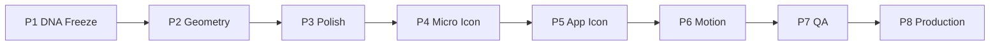

# LeylekTAG Logo Evolution Roadmap

**Phase:** P1 — Logo Evolution Analysis  
**Version:** Evolution Roadmap v1.0  
**Status:** Plan only — no drawing, no production  
**Date:** 2026-06-21  
**Parent:** `LOGO_EVOLUTION_CONSTITUTION.md`

---

## 0. Roadmap özeti

Logo Evolution **8 fazda** ilerler. P1 yalnızca analiz ve DNA freeze'tir. Çizim P2'den başlar; production dokunuşu **yalnızca P8**'dedir.

```
P1 DNA Freeze ──► P2 Geometry ──► P3 Polish ──► P4 Micro ──► P5 App Icon
                                                      │
P8 Production ◄── P7 QA ◄── P6 Motion ◄───────────────┘
```

**Kırmızı çizgi:** F1 Meridian Wing ship edilmez. Yeni marka tasarlanmaz.

---

## P1 — DNA Freeze ✅ (bu patch)

**Amaç:** Mevcut logonun korunacak DNA'sını ve evrim sınırlarını kilitlemek.

| Aktivite | Çıktı | Gate |
|----------|-------|------|
| Production envanter | `LOGO_SURFACE_MAP.md`, `PRODUCTION_LOGO_AUDIT.md` | Tam yüzey haritası |
| DNA analizi | `CURRENT_DNA_ANALYSIS.md` | Never Change listesi |
| Constitution | `LOGO_EVOLUTION_CONSTITUTION.md` | Stakeholder sign-off |
| Prensipler | `EVOLUTION_PRINCIPLES.md` | Multimodal uyum tanımı |
| Rakip dersleri | `COMPETITOR_EVOLUTION_ANALYSIS.md` | Evrim stratejisi |
| QA framework | `EVOLUTION_CHECKLIST.md` | P7 hazırlık |

**Exit criteria:**

- [ ] Canonical master = premium kuş onaylandı
- [ ] F1 production red onaylandı
- [ ] Üç aile birleştirme stratejisi onaylandı
- [ ] Production dosyası değiştirilmedi

**Süre tahmini:** 1 hafta (analiz — tamamlandı)

---

## P2 — Geometry Evolution

**Amaç:** design-lab'da premium kuş + arc anchor geometry'nin vector trace'i — **form aynı, geometri kalibre**.

| Aktivite | Detay |
|----------|-------|
| Master SVG trace | `leylek-logo-premium.png` referans — optically centered |
| Wing arc unify | SVG kanat path + PNG kanat oyuk → tek stroke |
| Lock ring | 3D arc → flat ellipse; sweep yönü korunur |
| Horizon | Wireframe taban çizgisi master'a entegre |
| Grid | 8px base; %32 negatif alan |
| Tier path prep | M0→L layer structure (henüz export yok) |

**Non-goals:** Yeni kuş çizmek; F1 formu; production commit.

**Exit criteria:**

- Master SVG design-lab'da
- Siluet overlay IoU ≥85% vs premium PNG
- Anchor geometry dokümante

**Süre tahmini:** 2–3 hafta

---

## P3 — Premium Polish

**Amaç:** Restraint premium — metal shader kaldır, flat/light emboss ekle.

| Aktivite | Detay |
|----------|-------|
| Malzeme dili | Flat primary; hafif depth L-tier only |
| Renk kalibrasyon | Accent → `#00D4AA`; form → Trust White |
| Glow policy | Idle off; boot max 0.25 |
| Violet retire spec | Website hero wrapper kaldırma planı |
| Monochrome varyant | Watermark / print spec |

**Exit criteria:**

- Color system doc sync (`LOGO_COLOR_SYSTEM.md` evolution addendum)
- Side-by-side "daha net, aynı logo" blind test ≥80%

**Süre tahmini:** 1–2 hafta

---

## P4 — Micro Icon

**Amaç:** 16–32 px tier ladder (M0, M1).

| Aktivite | Detay |
|----------|-------|
| M0 | Dot + arc sweep — favicon, notification |
| M1 | + horizon hint — compact navbar |
| PNG ladder | 16, 20, 24, 32, 48 export (design-lab) |
| Red team | Uber/Google pin yan yana — karışmama |

**Exit criteria:**

- 16 px QA pass
- 32 px navbar mock pass

**Süre tahmini:** 1 hafta

---

## P5 — App Icon

**Amaç:** iOS + Android adaptive unify — tier S.

| Aktivite | Detay |
|----------|-------|
| iOS 1024 ladder | App Store set |
| Android adaptive | Foreground safe zone; `#08111F` ground |
| Squircle clip test | Wing apex safe |
| Expo manifest map | `app.json` path plan (P8 uygulama) |

**Exit criteria:**

- iOS = Android aynı tier S ailesi
- 29 px settings icon pass

**Süre tahmini:** 1–2 hafta

---

## P6 — Motion Integration

**Amaç:** Logo animasyonu LSX + LSDS ile hizala.

| Aktivite | Detay |
|----------|-------|
| Boot | `presence.pulse` 550 ms — SplashScreen token sync |
| Lock | `lock.ringClose` 320 ms — QR overlay spec |
| Lottie/SVG | Ring dasharray-ready master |
| LeylekEye | Iris cyan kalibrasyon |

**Exit criteria:**

- Motion spec `LOGO_MOTION.md` evolution addendum
- Ses-görsel peak sync ±20 ms

**Süre tahmini:** 1–2 hafta

---

## P7 — QA

**Amaç:** Ship öncesi tam checklist.

| Aktivite | Detay |
|----------|-------|
| `EVOLUTION_CHECKLIST.md` | Tüm maddeler |
| Blind tanınırlık | ≥85% LeylekTAG |
| Platform matrix | 12+ yüzey |
| Accessibility | Contrast WCAG |
| Print / monochrome | 15 mm test |
| Regression | Orphan asset list |

**Exit criteria:**

- QA report design-lab'da
- Zero P0 open issues

**Süre tahmini:** 1 hafta

---

## P8 — Production Migration

**Amaç:** Onaylı asset'lerin production'a geçişi — **tek seferde veya aşamalı**.

| Yüzey | Dosya (hedef) | Öncelik |
|-------|-----------------|---------|
| Premium master | `frontend/assets/images/leylek-logo-premium.png` | P0 |
| iOS icon | `frontend/assets/ios.premium.logo.png` | P0 |
| Android adaptive | `frontend/assets/images/adaptive-icon-foreground.png` | P0 |
| Android splash | `res/drawable-*/splashscreen_logo.png` | P0 |
| Website icon | `website/public/store/leylektag-icon.png` | P0 |
| Favicon / PWA | `BRANDING_PATHS.*` | P0 |
| Hero / OG | `feature-graphic.png` | P1 |
| Orphan retire | `logo-leylek.svg`, dead components | P1 |
| Backend static | `backend/static/images/leylek-logo.png` | P2 |
| LeylekEye | `LeylekEye.tsx` iris token | P2 |

**Non-goals (P8):** Frontend logic refactor; hero restructure — yalnızca asset swap + minimal path.

**Exit criteria:**

- Production audit P8 re-run — zero family split
- App store screenshot refresh planı

**Süre tahmini:** 1–2 hafta (engineering)

---

## Risk register

| Risk | Faz | Mitigasyon |
|------|-----|------------|
| "Logo değişti" algısı | P3–P8 | Aşamalı rollout; evolution mesajı |
| Android res stale | P5, P8 | prebuild + DPI sync checklist |
| F1 scope creep | P2 | Constitution `ban.f1Ship` |
| Wordmark unutulması | P4–P5 | M0/M1 + wordmark lockup rule |
| Backend static missing | P8 | Asset oluştur + deploy |

---

## Bağımlılık grafi



---

## Önceki logo-master roadmap ile ilişki

| logo-master ROADMAP | logo-evolution | Not |
|---------------------|----------------|-----|
| Phase 0 Analiz | P1 | Tamamlandı |
| Phase 1 DNA | P1 DNA Freeze | Aynı |
| Phase 2 Sketch | — | F1 sketch lab — **ship yok** |
| Phase 3 Production lab | P2–P5 | Mevcut logo trace |
| Phase 4 Export | P4–P5 | design-lab only |
| Phase 5 Migration | P8 | Onay sonrası |

---

**İlişkili belgeler:** `LOGO_EVOLUTION_CONSTITUTION.md`, `EVOLUTION_CHECKLIST.md`, `PRODUCTION_LOGO_AUDIT.md`
