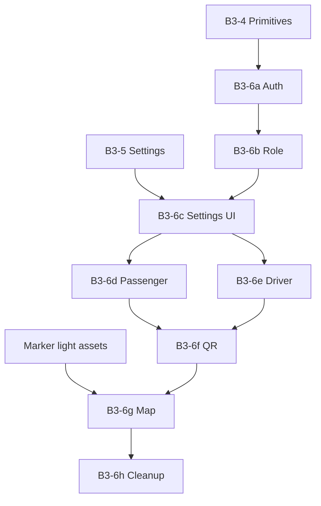

# B3-6 Migration Order

**Sprint:** B3-6 — Safe rollout sequence  
**Date:** 2026-06-21

---

## Principles

1. **Smallest surface first** — auth chrome before index.tsx dashboards  
2. **Validate settings loop early** — B3-6c before heavy shells  
3. **Map last** — requires marker assets  
4. **Flags OFF default** — each patch TestFlight-gated  
5. **One screen group per PR** where possible

---

## Official sequence

| Phase | ID | Scope | Flag slice | Est. files |
|-------|-----|-------|------------|------------|
| 1 | **B3-6a** | Auth / Login shell | `auth` | 4–5 |
| 2 | **B3-6b** | Role Select | `role` | 2–4 |
| 3 | **B3-6c** | Settings / Profile / Legal | `settings` | 6–8 |
| 4 | **B3-6d** | Passenger shell | `passenger` | 6+ (split) |
| 5 | **B3-6e** | Driver cockpit | `driver` | 6+ |
| 6 | **B3-6f** | QR / Payment / Trust modals | `qr` | 7 |
| 7 | **B3-6g** | LiveMapView / map overlays | `map` | 5+ **blocked on markers** |
| 8 | **B3-6h** | Final cleanup | `*` | Admin, stragglers, index sweep |

---

## B3-6a detail (first patch)

**Goal:** Smallest visible delta; production unchanged when flags OFF.

```
PR-6a.1 (recommended first merge):
  - premiumAuthChrome.tsx token pass (CTA body, borders)
  - LoginScreen.tsx remaining PREMIUM inline
  - OtpVerificationScreen.tsx same

PR-6a.2:
  - index.tsx register/otp/pin TextInput colors only

Flags:
  EXPO_PUBLIC_FEATURE_LIGHT_THEME=false (prod)
  EXPO_PUBLIC_FEATURE_LIGHT_THEME_SCREENS=auth (TestFlight only)
```

**Why auth first:** Isolated flow, strong primitive coverage, no map dependency.

---

## B3-6b — Role Select

After auth validated. PremiumSelectionCard already theme-aware — high ROI.

---

## B3-6c — Settings (before dashboards)

User can toggle theme and verify in hub/profile **before** passenger/driver complexity.

Requires: `themeSettingsEnabled` ON on TestFlight (B3-5).

---

## B3-6d / B3-6e — Dashboards

Split index.tsx into multiple PRs:

| PR | Section |
|----|---------|
| 6d.1 | PassengerWaitingScreen |
| 6d.2 | Match mode / QM flow |
| 6d.3 | index passenger shell chrome |
| 6e.1 | driverWaitingShellStyles + quick strip |
| 6e.2 | DriverOfferScreen chrome (not map) |
| 6e.3 | index driver shell |

---

## B3-6f — Modals

After main shells stable. RatingModal first (lowest risk).

---

## B3-6g — Map (gate)

**Do not ship until:**

- [ ] Light marker PNG set in repo
- [ ] `mapNavMarkers.ts` theme resolver
- [ ] LiveMapView bottom sheet token pass QA

---

## B3-6h — Cleanup

- `SplashScreen` policy (dark-only vs themed)
- `AdminPanel.tsx`
- Remaining PREMIUM_* grep sweep in index.tsx
- Remove screen flag gating → global `lightThemeEnabled`

---

## Dependency graph



---

## NOT in scope for B3-6

- Extracting auth from index.tsx to routes
- Google Maps custom style JSON
- Logo/marker asset production (separate sprints)
- Website theme
