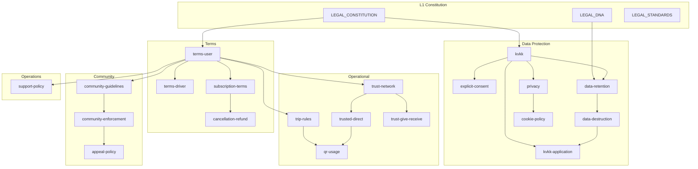

# LeylekTAG Legal Dependency Graph

**Phase:** P2-L1  
**Version:** v1.0  
**Parent:** `LEGAL_CONSTITUTION_V1.md`

---

## 1. Belge → belge bağımlılıkları



---

## 2. Belge → production sistem bağımlılıkları

| SSOT belge | Website | Mobile | Backend API | Store | Support | Admin |
|------------|---------|--------|-------------|-------|---------|-------|
| kvkk | `/kvkk` | `/kvkk` | `/legal/kvkk` | Data safety | FAQ link | — |
| explicit-consent | — | Registration | Consent API | — | — | Audit log |
| privacy | `/gizlilik-politikasi`, `/privacy` | `/privacy` | `/legal/privacy` | **Privacy URL** | — | — |
| terms-user | `/kullanim-sartlari` | `/terms` | `/legal/terms` | Terms URL | — | — |
| terms-driver | — | KYC screen | KYC API | — | — | Driver ops |
| trust-network | topluluk info | Trust hub | trust API | — | — | Trust ops |
| trusted-direct | guvenlik | TDM UI | match channel | — | — | — |
| qr-usage | guvenlik | QR modals | trip QR | — | — | — |
| trust-give-receive | — | TrustRequestModal | trust API | — | — | — |
| trip-rules | guvenlik | Trip flows | tags API | — | Disputes | — |
| community-guidelines | topluluk | Muhabbet | chat API | — | — | Mod queue |
| cookie-policy | banner | — | — | — | — | — |
| data-retention | KVKK ref | — | cron jobs | — | Answers | — |
| data-destruction | hesap-silme | delete-account | delete API | Deletion URL | Tickets | — |
| kvkk-application | form page | link | ticket API | — | **Primary** | KVKK queue |
| subscription-terms | — | settings | billing | IAP | — | — |
| cancellation-refund | — | settings | billing | Store | **Primary** | — |
| support-policy | `/support` | help | — | Support URL | **Primary** | SOP |
| community-enforcement | — | ban notice | admin API | — | Escalation | **Primary** |
| appeal-policy | — | appeal UI | admin API | — | **Primary** | **Primary** |

---

## 3. Mevcut kod → SSOT belge bağımlılığı (drift)

| Production artifact | Beslenmesi gereken SSOT | Şu an beslendiği | Drift |
|---------------------|-------------------------|------------------|-------|
| `legal-content.ts` | kvkk, terms-user, privacy, data-destruction | Self (May 2026) | Privacy duplicate |
| `privacy-policy-locales.ts` | privacy | Self | Parallel TR privacy |
| `legal.py` | kvkk, terms-user, privacy | Hardcoded 2025 | **P0 stale** |
| `LegalPages.tsx` | Same | legal.py | **P0 stale** |
| `KVKKComponents.tsx` | kvkk, explicit-consent | Embedded 2024 | **P0 wrong entity** |
| `privacy.tsx`, `kvkk.tsx`, `terms.tsx` | Same IDs | Hardcoded TSX | Partial sync |
| `LegalConsentModal` | terms-user, privacy, kvkk, explicit-consent | Checkboxes + API | Versionless |
| `DriverKYCScreen` terms | terms-driver | Generic checkbox | No doc |
| `trustedHubCopy.ts` | trust-network | Marketing copy | No legal |
| `TrustRequestModal` | trust-give-receive | UI strings | No legal |
| `MetaPixel` | cookie-policy | Undisclosed | **Gap** |
| `footer.tsx` legal links | matrix URLs | Static array | OK paths, stale content |
| `app.json` privacyPolicyUrl | privacy | gizlilik-politikasi | URL OK, content drift risk |

---

## 4. Faz bağımlılığı

```
P2-L1 Constitution ──► P2-L2 Architecture schema
                              │
                              ▼
                         P2-L3 Drafts (dependency order:
                              kvkk → privacy → terms-user
                              → operational bundle
                              → community bundle)
                              │
                              ▼
                         P2-L4 Legal Review
                              │
                              ▼
                         P2-L5 Production Mapping
                              │
              ┌───────────────┼───────────────┐
              ▼               ▼               ▼
         Website wire    Mobile wire     Backend API wire
              │               │               │
              └───────────────┼───────────────┘
                              ▼
                         P2-L6 Migration (retire duplicates)
                              │
                              ▼
                         P2-L7 Store Compliance
```

---

## 5. Cross-program bağımlılıklar

| Program | Legal bağımlılık |
|---------|------------------|
| **Release Phase 3 QA** | Legal URLs resolve; consent flow test |
| **Release Phase 5 Store** | P2-L7 complete; privacy URL live |
| **Brand Phase 1** | Legal tone ↔ LHIS premium restraint |
| **Logo Evolution P8** | Backend static logo unrelated — legal text separate |

---

## 6. Kritik path (minimum viable legal SSOT)

```
kvkk + privacy + terms-user + explicit-consent
        ↓
data-retention + data-destruction
        ↓
terms-driver + qr-usage + trust-network
        ↓
Production P2-L5 wire
```

Community, cookie, support, enforcement → P2-L6 ops bundle.

---

**İlişkili:** `DOCUMENT_MATRIX.md`, `LEGAL_SSOT_PLAN.md`, `LEGAL_ROADMAP.md`
