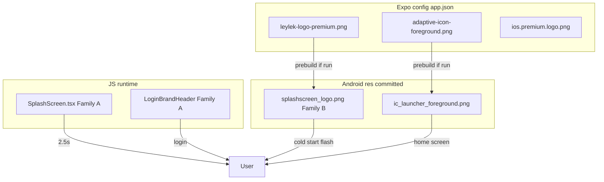

# 01 — Current Logo / Icon / Splash Pipeline

**Sprint:** BRAND-LAUNCH-2A (read-only)  
**Date:** 2026-06-21  
**Production touched:** No

---

## Executive summary

Production carries **two logo families** in parallel:

| Family | Visual | Primary surfaces |
|--------|--------|------------------|
| **A — Premium stork** | 3D metallic leylek + blue orbital ring on dark ground | `leylek-logo-premium.png`, JS splash, login, Leylek Zeka, `app.json` config |
| **B — Wireframe / pin** | Flat white stork + teal U-arc (minimal) | Android native `splashscreen_logo.png` (×5 DPI) |

The user sees **Family B first** (native cold start), then **Family A** (JS splash + login). Launcher uses a **third presentation**: adaptive foreground PNG (premium stork on **baked black** canvas) masked by Android — reads oversized and clipped.

---

## Boot sequence (Android APK)

```
Cold start
  └─ MainActivity.onCreate
       └─ SplashScreenManager.registerOnActivity (expo-splash-screen)
            └─ Theme.App.SplashScreen
                 • background: #08111F (colors.xml splashscreen_background)
                 • animatedIcon: @drawable/splashscreen_logo  ← Family B wireframe PNG
  └─ React Native bundle loads
  └─ app/_layout.tsx mount
       └─ ExpoSplashScreen.hideAsync()  ← native splash dismissed immediately
  └─ app/index.tsx
       └─ showSplash === true (default)
            └─ components/SplashScreen.tsx (~2500ms)
                 • leylek-logo-premium.png  ← Family A
                 • cinematic gradients, halos, wordmark plate
       └─ LoginBrandHeader (login screen)
            • leylek-logo-premium.png @ 100×100 + Leylek/TAG wordmark
```

**iOS:** `app.json` splash + `ios.premium.logo.png` for store icon; no committed `ios/` native tree in repo — EAS prebuild generates at build time. JS splash stack is identical.

---

## Config sources (`frontend/app.json`)

| Key | Asset / value | Intended surface |
|-----|---------------|------------------|
| `expo.icon` | `leylek-logo-premium.png` | Generic / legacy icon input |
| `expo.ios.icon` | `ios.premium.logo.png` | iOS home screen |
| `expo.android.adaptiveIcon.foregroundImage` | `adaptive-icon-foreground.png` | Android adaptive FG |
| `expo.android.adaptiveIcon.backgroundColor` | `#08111F` | Android adaptive BG |
| `expo.splash.image` | `leylek-logo-premium.png` | Expo native splash (prebuild) |
| `expo.splash.backgroundColor` | `#08111F` | Splash BG |
| `expo.splash.resizeMode` | `contain` | Splash scaling |
| `plugins.expo-notifications.icon` | `leylek-logo-premium.png` | FCM small icon source |

---

## Android native `res/` (committed)

| Path | Role | Observed family |
|------|------|-----------------|
| `values/styles.xml` → `Theme.App.SplashScreen` | Splash theme | BG + `splashscreen_logo` |
| `drawable-{mdpi…xxxhdpi}/splashscreen_logo.png` | Native splash center icon | **B — wireframe** |
| `mipmap-anydpi-v26/ic_launcher.xml` | Adaptive icon wrapper | FG + `iconBackground` |
| `mipmap-*/ic_launcher_foreground.png` | Launcher foreground | Premium stork (black baked) |
| `mipmap-*/ic_launcher.png` / `ic_launcher_round.png` | Legacy launcher | Generated raster |
| `values/colors.xml` | `splashscreen_background`, `iconBackground` | `#08111F` |
| `drawable/ic_launcher_background.xml` | Layer-list splash composite | BG + `splashscreen_logo` bitmap |

**Drift:** `app.json` splash image = Family A, but committed `splashscreen_logo.png` ladder = Family B. Prebuild not re-run after premium splash config, or manual `res/` edits retained old pin export.

---

## JS consumers (same raster, different chrome)

| Component | Asset | Presentation |
|-----------|-------|--------------|
| `SplashScreen.tsx` | `leylek-logo-premium.png` | Dynamic box ~34% short edge (max 168dp), halos, glass plate, animations |
| `LoginBrandHeader.tsx` | `leylek-logo-premium.png` | Fixed 100×100 (88 compact), wordmark text below |
| `LeylekZekaChat.tsx` | `leylek-logo-premium.png` | Empty-state 40×40 inside dark chip |
| `LeylekZekaWidget` / notifications | same / derived | Various |

No separate login PNG — login and splash share Family A raster; **presentation** differs (size, halos, typography).

---

## `_layout.tsx` native splash policy

```53:56:frontend/app/_layout.tsx
  // Native splash’i hemen kapat — aksi halde APK’da Leylek görseli üstte kalıp JS ekranı hiç görünmeyebilir
  useEffect(() => {
    void ExpoSplashScreen.hideAsync().catch(() => {});
  }, []);
```

Native splash is **intentionally short-lived** but still visible during RN init (typically 100–400ms+). That flash uses **Android `res/` drawables**, not `app.json` source directly, when committed native project is built.

---

## Backup / rollback artifacts in repo

| Location | Contents |
|----------|----------|
| `frontend/android/app/src/main/res/_backup-pre-b6-2/` | Prior splash + mipmap snapshot |
| `frontend/android/app/src/main/res/_backup-pre-b6-3/` | Prior mipmap snapshot |
| `frontend/assets/images/_backup-pre-appicon-20260621/` | Prior adaptive + mipmap exports |
| `frontend/assets/images/_backup-pre-b6-2/` / `b6-4/` | Prior `leylek-logo-premium.png` |

---

## Pipeline diagram



---

## Key references

| Topic | Path |
|-------|------|
| Expo manifest | `frontend/app.json` |
| JS splash | `frontend/components/SplashScreen.tsx` |
| Login brand | `frontend/components/auth/LoginBrandHeader.tsx` |
| Native splash theme | `frontend/android/app/src/main/res/values/styles.xml` |
| Root hideAsync | `frontend/app/_layout.tsx` |
| Splash gate | `frontend/app/index.tsx` (~2917–2938) |
| Surface inventory | `design-lab/brand-dna/v4/logo-evolution/LOGO_SURFACE_MAP.md` |
