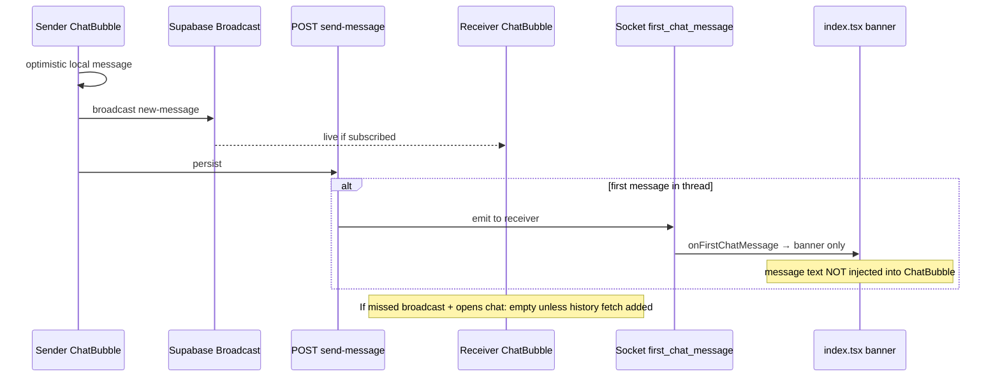

# UX-P0-CHAT — Current Chat Flow

**Sprint:** UX-P0-CHAT  
**Mode:** Read-only analysis  
**Scope:** TAG trip chat (passenger ↔ driver during matched/in_progress journey)  
**Out of scope:** Muhabbet/LeylekTrip (`MuhabbetChatScreen.tsx`), Leylek Zeka AI chat

---

## Architecture overview

TAG trip chat uses a **hybrid dual-transport** design that is only partially wired:

| Layer | Technology | Purpose |
|-------|------------|---------|
| Live delivery | Supabase Realtime **Broadcast** (`chat-broadcast-{tagId}`) | Instant UI when both clients subscribed |
| Persistence + first notify | `POST /api/chat/send-message` | DB insert, first-message push + socket |
| Dead path | Socket.io `send_message` emit from `index.tsx` | **No backend handler** — never delivers |
| Dead path | Socket.io `new_message` listener in `useSocket.ts` | **`onNewMessage` not registered** in `index.tsx` |
| Unused API | `GET /api/chat/messages` | **Never called** from frontend |
| Receipts | `message_delivered` / `message_seen` socket | **Muhabbet only** — not TAG chat |

Primary UI: `frontend/components/ChatBubble.tsx`  
Orchestration: `frontend/app/index.tsx` (PassengerDashboard + DriverDashboard)  
Map entry: `frontend/components/LiveMapView.tsx` → `onChat` → `set*ChatVisible(true)`

---

## Open chat path

### Passenger

1. Matched / in_progress trip → `LiveMapView` bottom bar **"Sürücüye Yaz"** (`onChat`).
2. Blocked after boarding: `boardingConfirmed` → alert `BOARDING_COMMS_CLOSED_USER_MSG`, chat button dimmed (opacity 0.45).
3. `setPassengerChatVisible(true)` → `ChatBubble` Modal slides up (60% screen height).

### Driver

1. Same pattern via `LiveMapView` driver bottom chat button.
2. `setDriverChatVisible(true)` → `ChatBubble` with `isDriver={true}`.

### First-message notification path (chat closed)

1. Sender types in `ChatBubble` → `sendMessage()`.
2. Local optimistic bubble + Supabase broadcast + `POST /chat/send-message`.
3. Backend (first message only, `first_message_sent` claim):
   - Expo push `type: first_chat_message`
   - Socket.io `first_chat_message` to receiver room
4. Receiver `onFirstChatMessage` in `index.tsx` (~9087 / ~16361):
   - If chat **already visible** → **early return** (no banner)
   - Else → `setFirstChatTapBanner({ title, subtitle })` on map overlay
5. User taps banner → `setPassengerChatVisible(true)` / driver equivalent.

Push notification tap (`paxChatNotifData` effect ~10296): opens chat + clears banner for `first_chat_message`.

---

## Send path (actual code)

```text
ChatBubble.sendMessage()
  1. Optimistic append to local messages[]
  2. channel.send({ event: 'new-message', payload })  ← Supabase Broadcast
  3. fetch POST /chat/send-message                     ← REST persist + first notify
```

**Not called:**

- `onSendMessage` prop (defined in `ChatBubbleProps`, passed from `index.tsx` with `emitSendMessage`)
- `passengerEmitSendMessage` / `driverEmitSendMessage` (Socket.io `send_message` — no server handler)

---

## Receive path (actual code)

```text
Supabase channel.on('broadcast', 'new-message')
  → append to messages[] if senderId !== userId
  → Vibration.vibrate(200)
  → unreadCount++ if !visible || isMinimized
```

**Not wired:**

- `incomingMessage` prop passed from `index.tsx` but **never destructured/used** in `ChatBubble`
- `setPassengerIncomingMessage` / `setDriverIncomingMessage` — **never called** anywhere
- `onNewMessage` socket callback — **not passed** to `useSocket` in `index.tsx`

---

## Message history

- On `tagId` change: `setMessages([])` — clears local state.
- On chat open: **no fetch** from `GET /chat/messages`.
- DB is source of truth on backend; UI is **ephemeral** unless messages arrived via broadcast while component mounted.

---

## Boarding comms lock

| Layer | Behavior |
|-------|----------|
| `tripCommsLocked={!!boarding_confirmed_at}` | Disables input + suggestions in UI |
| `POST /chat/send-message` | Returns `boarding_comm_closed` if `boarding_confirmed_at` set |
| `LiveMapView` | Chat button shows alert instead of opening |

Aligned — post-boarding chat send blocked at UI + API.

---

## Components map

| File | Role |
|------|------|
| `ChatBubble.tsx` | TAG trip chat UI + Supabase + REST send |
| `ChatScreen.tsx` | Re-export of `MuhabbetChatScreen` — **not TAG** |
| `MuhabbetChatScreen.tsx` | Full chat product (status, retry, receipts) — reference impl |
| `LeylekZekaChat.tsx` | AI assistant — advanced keyboard UX reference |
| `LiveMapView.tsx` | Chat launcher on trip map |
| `index.tsx` | Modal visibility, first-chat banner, dead socket wiring |
| `hooks/useSocket.ts` | Listens `new_message`, `first_chat_message`, `message_sent` |
| `contexts/SocketContext.tsx` | `emitSendMessage` → `socket.emit('send_message')` |

---

## Backend endpoints (TAG)

| Endpoint | File | Notes |
|----------|------|-------|
| `POST /chat/send-message` | `server.py` ~23982 | Insert + first push/socket |
| `GET /chat/messages` | `server.py` ~24198 | Pagination — unused by app |
| `POST /chat/mark-read` | `server.py` ~24231 | Unused by TAG ChatBubble |

Socket emit on first message only:

```python
await sio.emit("first_chat_message", {
    "tag_id", "sender_id", "sender_name", "message",
    "message_preview", "from_driver", "created_at"
}, room=receiver)
```

Subsequent messages: **no socket emit** — rely on Supabase broadcast.

---

## Flow diagram



---

## Key gaps (preview)

1. Dead Socket.io send/receive path in `index.tsx`.
2. No history load on chat open.
3. First message socket payload ignored for message list.
4. `incomingMessage` prop orphaned.

See `03_INCOMING_MESSAGE_VISIBILITY.md` and `06_PATCH_PLAN.md`.
