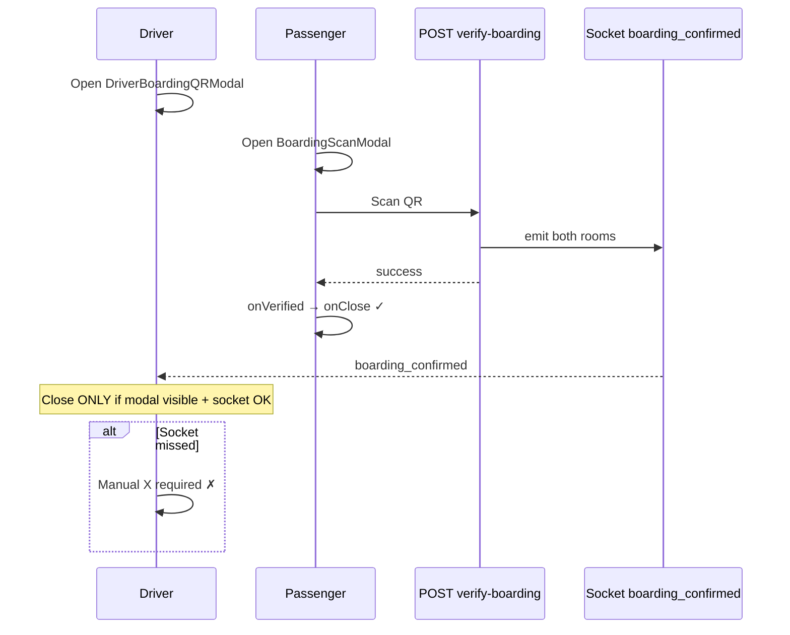
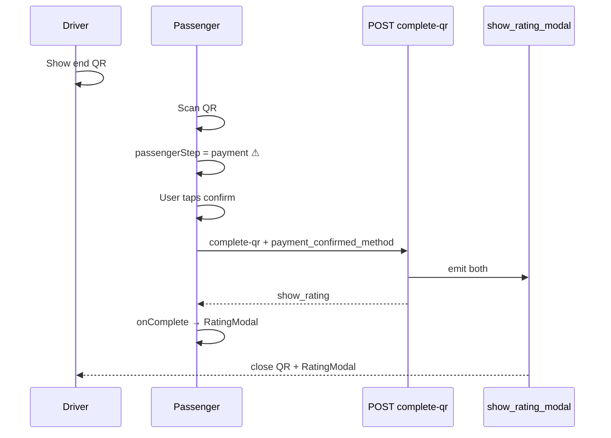

# UX-P0-QR — Current Flow Analysis

**Sprint:** UX-P0-QR  
**Mode:** Read-only analysis  
**Date:** 2026-06-21  
**Scope:** Boarding QR + Trip finish QR + payment copy + Quick Match

---

## Executive summary

| Bug | User report | Root cause (code) |
|-----|-------------|-------------------|
| #1 | Passenger scan succeeds; **driver** must tap X | Driver modal auto-close is **100% socket-dependent** (`boarding_confirmed`). No fallback from `activeTag.boarding_confirmed_at` or passenger verify response. |
| #2–3 | Trip end scan should complete + rating; passenger sees payment step | `QRTripEndModal.handleBarCodeScanned` **always** sets `passengerStep = 'payment'` after scan beat — never auto-calls `submitCompleteQr`. |
| #4 | "Nakit ödedim" language | Exact string **not in repo**; closest is "Nakit katkı", "Ücreti nakit olarak ödediğinizi onaylayın" in `QRTripEndModal.tsx`. |

---

## A. Boarding QR flow

### Roles and components

| Role | UI | File |
|------|-----|------|
| Driver shows QR | `DriverBoardingQRModal` | `frontend/components/DriverBoardingQRModal.tsx` |
| Passenger scans | `BoardingScanModal` | `frontend/components/BoardingScanModal.tsx` |
| Orchestration | `index.tsx` handlers + socket | `frontend/app/index.tsx` |

### Who opens what

1. **Driver** opens `DriverBoardingQRModal` (`setDriverBoardingQrModalVisible(true)`).
2. Modal fetches `POST /qr/boarding-code` → renders `leylektag://board?...` QR.
3. **Passenger** opens `BoardingScanModal` (`passengerBoardingScanVisible`).
4. Passenger camera scans QR → `POST /qr/verify-boarding`.

### Success path — passenger

```
BoardingScanModal.verify()
  → POST /qr/verify-boarding
  → success: success beat → onVerified(payload)
  → if onVerified returns true → onClose()
```

`handlePassengerBoardingVerified` (`index.tsx` ~9803–9894):

- Updates `activeTag` → `status: in_progress`, sets `boarding_confirmed_at`.
- Shows `appAlert('Biniş onaylandı', ...)` with `autoDismissMs: 2600`.
- Returns **`true`** → modal closes.

Parallel: socket `onBoardingConfirmed` (passenger) calls `schedulePassengerBoardingScanClose` (~9259–9279) — double `requestAnimationFrame` close.

**Passenger side is largely correct** when verify succeeds and tag IDs match.

### Success path — driver

Driver modal **does not self-close**. It only shows `remoteSuccess` overlay when parent sets `driverBoardingRemoteSuccess`.

Parent closes via socket handler only:

```typescript
// index.tsx ~16504–16541 onBoardingConfirmed (driver)
if (!driverBoardingQrModalVisibleRef.current) return;
if (driverBoardingRemoteAckTagRef.current === tagKey) return; // dedupe
setDriverBoardingRemoteSuccess(true);
setTimeout(() => {
  setDriverBoardingRemoteSuccess(false);
  setDriverBoardingQrModalVisible(false);
}, BOARDING_REMOTE_ACK_MS); // 400ms
```

### Backend + socket

`POST /qr/verify-boarding` (`backend/server.py` ~21740):

- Updates tag `matched → in_progress`, sets `boarding_confirmed_at`.
- Emits `boarding_confirmed` to **both** passenger and driver rooms.
- Idempotent path if already confirmed.

### Why manual X is still required (Bug #1)

Driver auto-close requires **all** of:

1. Socket `boarding_confirmed` received while app foregrounded.
2. `driverBoardingQrModalVisibleRef.current === true` at socket arrival.
3. `driverBoardingRemoteAckTagRef` not already set for this tag.

Failure modes:

| Scenario | Result |
|----------|--------|
| Socket delayed / dropped | Driver sees QR forever until X |
| Socket arrives before modal ref synced | Early return at line 16524 |
| Duplicate socket suppressed by ack ref | Second event ignored (OK) |
| Driver modal closed then reopened | Ack ref may block re-close |

**There is no driver-side close tied to passenger HTTP success** — only socket.

`DriverBoardingQRModal` has no `useEffect` on `remoteSuccess` calling `onClose`; parent owns the timer.

---

## B. Trip finish QR flow

### Roles and components

| Role | UI | File |
|------|-----|------|
| Both (mode split) | `QRTripEndModal` | `frontend/components/QRTripEndModal.tsx` |
| Rating | `RatingModal` | `frontend/components/RatingModal.tsx` |
| Orchestration | `index.tsx` | `frontend/app/index.tsx` |

### Driver end flow

- Driver opens trip-end QR modal (`showQRModal`, `isDriver=true`).
- Shows static QR: `leylektag://end?u={driverId}&t={tagId}`.
- Waits for passenger to complete via API.
- On socket `show_rating_modal` while QR open: `driverTripEndRemoteSuccess` + 400ms timer → close QR + `scheduleDriverRating()` (~16464–16502).

### Passenger end flow

Initial step depends on channel and IBAN snapshot:

```typescript
// QRTripEndModal reset on visible
passengerStep = (isTrustedDirect || showIbanOption) ? 'choose' : 'scan'
```

- `showIbanOption` = `canOpenDriverPaymentDetails` → requires `matched_bank_account_id` + boarding confirmed.
- **Quick Match / normal with cash booking, no IBAN:** starts at `'scan'`.

After successful scan (`handleBarCodeScanned` ~259–270):

```typescript
setPendingDriverId(driverUserId);
setPassengerStep('payment');  // ← intentional second step
```

Payment step requires tap:

- `handlePassengerPaymentConfirm('cash'|'card')` → `submitCompleteQr(method, pendingDriverId)`
- Or legacy picker for missing `bookingPaymentMethod`

`submitCompleteQr` (~149–186):

- `POST /trip/complete-qr` with `payment_confirmed_method`.
- On success: `onComplete(true, ...)` + `onClose()`.

Parent `handlePassengerTripEndComplete` (~7863–7884):

- Closes QR modal, `scheduleRatingModalAfterQrDismiss` → opens `RatingModal`.
- Clears `activeTag`.

### Backend confirmation

`POST /trip/complete-qr` (`backend/server.py` ~22157):

- Validates scanner = passenger, scanned = driver.
- **Blocks trusted channel** (409 — driver payment confirmation required).
- Requires `payment_confirmed_method` when `passenger_payment_method` is `cash` or `card`.
- `should_reject_complete_qr` may block IBAN trips until transfer confirmed (409).
- On success: tag `completed`, emits `show_rating_modal` to both rooms, returns `show_rating: true`.

### Current prompts after scan (Bug #2–3)

Even when `bookingPaymentMethod === 'cash'` (pre-selected at offer):

1. Scan success animation (~success beat delay).
2. Transition to **payment panel** with copy like "Nakit katkı" / "onaylayın".
3. User must tap confirm before `complete-qr` and rating.

This is **by design in current code**, not a backend failure.

### Rating modal trigger

| Path | Trigger |
|------|---------|
| Passenger | HTTP success → `onComplete` → `scheduleRatingModalAfterQrDismiss` |
| Driver | Socket `show_rating_modal` → timer → `scheduleDriverRating` |
| Socket backup | Both sides also listen `show_rating_modal` independently |

Double rAF pattern (~286–294) avoids iOS double-modal touch swallow.

---

## C. Payment language (overview)

See `04_PAYMENT_COPY_ANALYSIS.md` for full string inventory.

- No literal **"Nakit ödedim"** in frontend grep.
- Passenger-facing trip-end strings live mainly in `QRTripEndModal.tsx`.
- Quick Match onboarding already uses **"katkı payı"** in `QuickMatchPassengerFlow.tsx`.
- Backend transfer guard uses **"Havale/EFT ile iletilen yol paylaşım katkısı..."** (`transfer_payment_service.py`).

---

## D. Quick Match specific

- `match_channel`: `'normal' | 'quick' | 'trusted'` on tag (`index.tsx` ~797).
- Quick Match uses **same** `QRTripEndModal` — not a separate end modal.
- `isTrustedDirect` only when `match_channel === 'trusted'` → bypasses QR scan for end (cash/IBAN claim flow).
- Quick Match with `passenger_payment_method: 'cash'` and no IBAN snapshot: scan → **payment step** (same bug as normal).
- Quick Match with IBAN snapshot: `choose` step first (cash vs havale), then scan, then payment confirm.

---

## E. Safety constraints (must not break)

| Area | Requirement |
|------|-------------|
| Idempotency | Backend boarding verify + complete-qr handle duplicate/idempotent scans |
| IBAN guard | `should_reject_complete_qr` must still block premature complete when transfer pending |
| Trusted channel | Must not route through `complete-qr` (409 by design) |
| Duplicate scan | `lastScannedValueRef`, `verifyInFlightRef`, boarding token consume |
| Modal stacking | Keep `scheduleRatingModalAfterQrDismiss` / boarding close rAF pattern on iOS |
| Socket optional | HTTP success paths must work if socket missed (driver boarding currently fails this) |

---

## Flow diagrams

### Boarding (current)



### Trip finish (current)



---

## Affected production files (reference only — not modified in this sprint)

| File | Role |
|------|------|
| `frontend/components/BoardingScanModal.tsx` | Passenger boarding scan |
| `frontend/components/DriverBoardingQRModal.tsx` | Driver boarding QR display |
| `frontend/components/QRTripEndModal.tsx` | Trip end QR + payment step |
| `frontend/app/index.tsx` | Handlers, socket, modal state |
| `frontend/components/RatingModal.tsx` | Post-trip rating |
| `backend/server.py` | `/qr/verify-boarding`, `/trip/complete-qr` |
| `backend/services/transfer_payment_service.py` | IBAN/cash complete guards |

**Out of scope for TAG main flow:** `MuhabbetTripQrScanModal.tsx` (LeylekTrip/Muhabbet channel).
