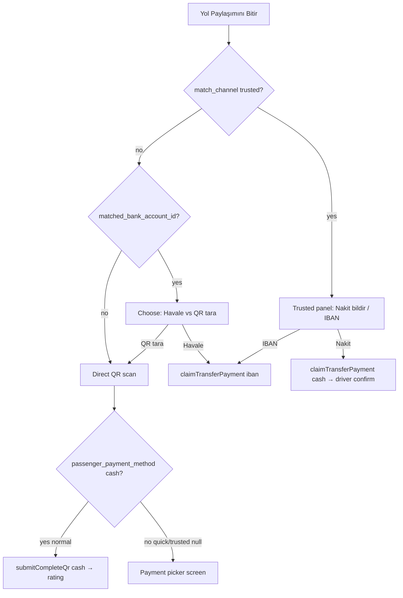

# 01 — Normal vs Quick vs Trusted QR Finish Flow

**Sprint:** UX-P0-QR-3A (read-only)  
**Reference:** Normal match (`match_channel=normal`) QR finish is the gold standard.

---

## Normal match (reference)

| Stage | Behavior |
|-------|----------|
| Tag creation | `POST /ride/create` sets `passenger_payment_method` (defaults to `cash` on client + server when provided) |
| `match_channel` | `normal` (DB default) |
| IBAN snapshot | Optional — `build_snapshot_fields_for_tag_update` may set `matched_bank_account_id` when driver has active bank account |
| Trip end entry | Passenger → “Yol Paylaşımını Bitir” → `QRTripEndModal` |
| Modal initial step | **Scan** if no IBAN snapshot; **Choose** (Havale vs QR) if `showIbanOption` |
| After QR scan | If `passenger_payment_method === 'cash'` → `submitCompleteQr('cash')` immediately → rating |
| Backend | `POST /trip/complete-qr` completes tag, emits `show_rating_modal` to both sides |
| Havale path | Choose → IBAN sheet → `claimTransferPayment(..., { method: 'iban' })` → driver confirm → complete + rating |

---

## Quick Match (`match_channel=quick`)

| Stage | Behavior |
|-------|----------|
| Tag creation | `accept_quick_match_invite` in `backend/services/quick_match.py` — **does not set `passenger_payment_method`** |
| `match_channel` | Explicitly `'quick'` |
| IBAN snapshot | Often present — same `build_snapshot_fn` on accept |
| Trip end entry | Same `QRTripEndModal` wiring in `index.tsx` |
| Modal initial step | Frequently **Choose** (driver IBAN snapshot → `canOpenDriverPaymentDetails` → `showIbanOption=true`) |
| User picks “Sürücü QR kodunu tara” | Enters scan step (non-trusted choose panel) |
| After QR scan | **`canAutoCompleteCashAfterScan` is false** because `bookingPaymentMethod` is null → **payment step** (“Katkı payını nasıl ilettiğinizi seçin”) |
| Backend (if user confirms cash manually) | With IBAN snapshot + `passenger_payment_method` null → `should_reject_complete_qr` returns 409 (see doc 02) |

**Gap vs normal:** Missing booked payment method on tag + stricter auto-complete gate in modal.

---

## Trusted Direct / Sürücülerim (`match_channel=trusted`)

| Stage | Behavior |
|-------|----------|
| Tag creation | `accept_invite` in `relationship_match_engine.py` — **does not set `passenger_payment_method`** |
| `match_channel` | `'trusted'` |
| IBAN snapshot | Same optional snapshot on accept |
| Trip end UI | **`isTrustedDirect === true`** → dedicated panel: cash claim OR Havale/EFT — **no “Sürücü QR kodunu tara” option** |
| QR scan handler | `handleBarCodeScanned` returns immediately when `isTrustedDirect` |
| Backend | `complete-qr` **always 409** for `match_channel=trusted` (`trusted_direct_requires_driver_payment_confirmation`) |

**Important distinction:** If the reported bug includes scanning driver QR on trusted direct, either (a) the tag’s `match_channel` on device is not `trusted`, or (b) the user describes Quick Match from the trusted hub, or (c) an older/different build exposed QR on trusted. **Current code blocks QR finish for trusted channel end-to-end.**

---

## Side-by-side decision tree (passenger)

---

## Driver parity (unchanged across channels for QR path)

- Driver shows personal end QR (`leylektag://end?u={driver}&t={tag}`) when not trusted-direct waiting UI.
- On passenger `complete-qr` success: socket `show_rating_modal` + optional `remoteSuccess` overlay if driver modal open.
- Trusted driver end: waiting for passenger cash/IBAN claim, not QR display.

---

## Summary

| Channel | QR scan offered? | Auto-complete after scan? | Rating after QR success? |
|---------|------------------|---------------------------|--------------------------|
| normal + cash booked | Yes | Yes | Yes |
| normal + IBAN + cash booked | Yes (via choose) | Yes | Yes |
| quick | Yes (via choose if IBAN) | **No** (null payment method) | Only if manual confirm succeeds |
| trusted | **No** (UI) / blocked (API) | N/A | Via driver confirm on claim, not QR |
