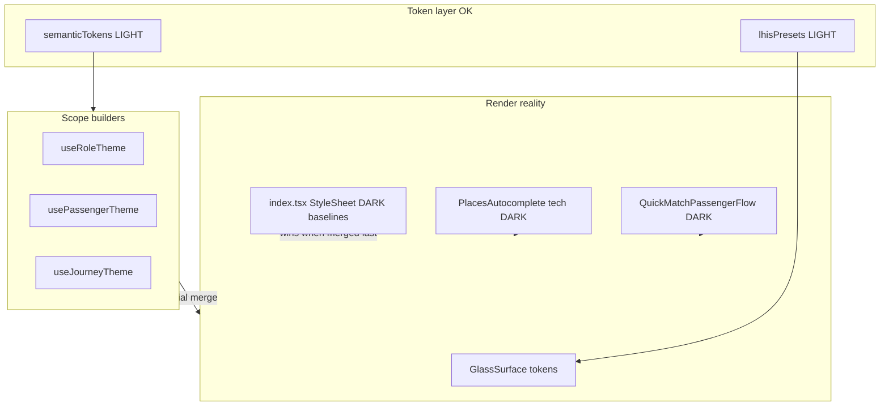

# WHITE-LHS-MASTER-1A — Root Cause Analysis

**Sprint:** WHITE-LHS-MASTER-1A  
**Question:** Why is white theme “dark inverted” instead of LHS Premium daylight?

---

## Executive summary

The token **constitution** for light theme exists (`semanticTokens.ts`, `lhisPresets.ts`, per-scope surface builders). Production UI still reads as inverted because:

1. **StyleSheet-first architecture** — dark navy baselines were authored first; light theme adds optional overlay objects (`*Lt`, `rpLt`, `jLt`) merged ad hoc in JSX.
2. **Override inversion** — parent `style` arrays often re-apply dark `backgroundColor` / light `color` *after* token-aware primitives, undoing `GlassSurface` and `PremiumSelectionCard`.
3. **Forced dark sub-components** — `PlacesAutocomplete` `visualVariant="tech"` and `QuickMatchPassengerFlow` bypass passenger scope entirely.
4. **Incomplete merge coverage** — tokens are **defined** in `usePassengerTheme` but not **wired** to all nodes (grep: 28 `rpLt?` sites vs dozens of hardcoded route-picker text styles).

This is not a missing flag problem; it is a **systematic consumption gap**.

---

## Root cause 1 — `roleUnifiedCockpitShell` dark anchor

```24487:24508:frontend/app/index.tsx
  roleUnifiedCockpitShell: {
    ...
    backgroundColor: 'rgba(5,11,24,0.44)',
    borderColor: 'rgba(26,48,78,0.55)',
    ...
  },
```

Used on:

- Match decision: `GlassSurface` + `roleUnifiedCockpitShell` (~13318) — **no light override**
- Offer/searching cockpit: same (~12408) — **no light override**

Role select **does** override:

```388:390:frontend/components/premium/RoleSelectScreen.tsx
                styles.roleUnifiedCockpitShell,
                roleLt?.roleUnifiedCockpitShell,
```

**Effect:** Light `GlassSurface` panel preset is replaced by 44%-opacity navy. Cards inside may be light-themed, but the cockpit reads as a **dark porthole** on a light canvas → “inverted” feel.

---

## Root cause 2 — Typography assumes dark card

| Pattern | Example | Light failure |
|---------|---------|---------------|
| Near-white titles | `PREMIUM_TEXT_SOFT`, `destinationHeroTitle` `#F8FAFC` | Invisible / low contrast on white panel |
| Muted as blue-grey for dark | `rgba(186,201,222,0.9)` in route picker subtitles | Washed on `#EEF2F7` |
| CTA label white | `pickupUseLocationBtnText` `rgba(248,250,252,0.98)` | Correct on dark glass; wrong on `rpLt` light glass |

`usePassengerTheme` already defines fixes (`pickupUseLocationBtnText`, `destinationHeroTitleStep`) — **JSX omits merges** on pickup step and CTAs.

---

## Root cause 3 — PlacesAutocomplete dual palette

Route picker always passes:

```tsx
visualVariant="tech"
```

`PlacesAutocomplete` StyleSheet pairs:

- Default: `#F8F9FA` input (light)
- `*Tech`: `rgba(16, 26, 43, 0.88)` input, dark suggestion rows

There is **no** `visualVariant="lhs-daylight"` or theme hook. Search UI is **explicitly dark** inside a flow that tries to be light → device report “address search bad.”

---

## Root cause 4 — Patchwork scope hooks

| Hook | Surfaces built | Wired in UI |
|------|----------------|-------------|
| `useRoleTheme` | 30+ keys | Role screen — high coverage |
| `usePassengerTheme` | waiting, searching, offer, dashboard, routePicker | Partial — routePicker text gaps; no `matchCockpitShell` |
| `useJourneyTheme` | 40+ chrome keys | LiveMap 63 sites — comm FABs missing |
| Quick Match | — | **Zero** |

Architecture diagram:



---

## Root cause 5 — LiveMap StyleSheet stack

`LiveMapView` applies `[styles.foo, jLt?.foo]`. Baselines use:

- Chip fills: `rgba(5,11,24,0.55)`
- Comm buttons: `rgba(16,26,43,0.87–0.92)`
- Route text: `rgba(243,248,255,0.92)`

`jLt` replaces `backgroundColor` on named surfaces but:

- Does not add `paxBottomCallBtn` / `ChatBtn` / `GuvenBtn` keys
- Leaves `color` on text styles unchanged → pastel-on-white
- `ui.ctaIcon` = `tokens.text.inverse` (#F5F7FA) on light button bg

Map tiles were fixed (`isScopeLight ? undefined : DARK_MAP_STYLE`); **chrome text/icon layer lagged**.

---

## Root cause 6 — Match cards: override competition

`PassengerMatchModeCards` now uses `buildLightMatchCardTheme` (improvement since B3-7A notes). Remaining issues:

- `PremiumSelectionCard` sets light `cardBackground` from `useTheme()`
- Parent `cardShellStyle` adds hero tints — OK in light builder
- Host `roleUnifiedCockpitShell` still dark (RC1)
- Disabled shell `opacity: 0.68` + slate — reads as fog, not “Yakında”
- Hierarchy: primary vs secondary rows same min-height / weight

Illustrations: **fixed** — `BlueprintIllustration` reads `resolvedTheme`.

---

## Hardcoded dark surface map (priority files)

| File | Approx. dark literals | Notes |
|------|----------------------|-------|
| `app/index.tsx` | 144+ `PREMIUM_*` / navy rgba | Route picker block 27071–27850 |
| `LiveMapView.tsx` | 100+ rgba baselines | StyleSheet bottom ~8460–10700 |
| `PlacesAutocomplete.tsx` | `*Tech` block 3372+ | Forced in route picker |
| `QuickMatchPassengerFlow.tsx` | All styles PREMIUM/dark | No hook |
| `PassengerMatchModeCards.tsx` | `stylesDark` retained for dark path only | Light path OK; host not |

---

## Why role/vehicle passes but match fails

Same `roleUnifiedCockpitShell` style object — **role applies `roleLt` override; match does not.** Same `GlassSurface` primitive — different merge discipline.

---

## No-logic-change boundary

All root causes are **style / token / variant** issues. Socket, match, QR scan, chat send, route confirmation handlers are unaffected by P0/P1 plans.

**ROOT CAUSE ANALYSIS COMPLETE.**
