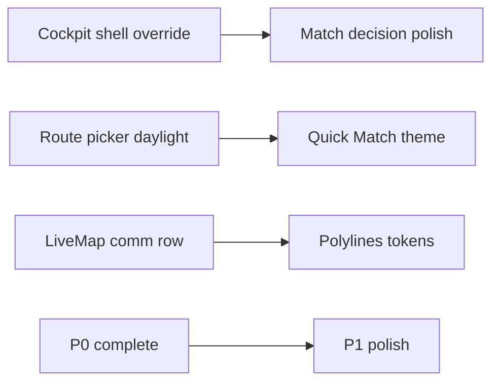

# WHITE-LHS-MASTER-1A — Risk Register

**Sprint:** WHITE-LHS-MASTER-1A  
**Mode:** Read-only analysis → patch guidance

---

## Risk matrix

| ID | Risk | Likelihood | Impact | Mitigation |
|----|------|------------|--------|------------|
| R1 | Dark theme regression on Gece | Medium | High | Every patch: `[darkBaseline, lightOverride]` only when `isScopeLight`; snapshot QA both themes |
| R2 | `roleUnifiedCockpitShell` fix breaks driver cockpit | Low | High | Override only passenger match + searching JSX sites; driver uses own shells |
| R3 | PlacesAutocomplete daylight variant breaks dark `tech` | Medium | Medium | Add variant, don’t mutate `tech`; keep explicit prop at call sites |
| R4 | LiveMap light tiles reduce route contrast | Low | Medium | Keep polyline token accent; test sun glare outdoor |
| R5 | `ctaIcon` change inverts QR button on dark | Medium | High | Branch in `buildJourneyUi`: inverse only on filled accent bg |
| R6 | Partial `rpLt` merge misses a Text node | High | Medium | Grep gate: every route-picker `styles.*Text` must pair with `rpLt` or `PremiumText` |
| R7 | Quick Match modal style pass touches session logic | Low | Critical | **Files:** styles + theme hook only; no changes to `useQuickMatchPassengerSession` |
| R8 | Style array order — light override before dark | Medium | High | Convention: `[styles.dark, lt?.light]` always |
| R9 | Android elevation + light shadow looks flat | Medium | Low | Use `LIGHT_ELEVATION_PRESETS`; test API 31+ |
| R10 | iOS glass transparency over live map | Medium | Medium | Prefer `header`/`plain` opacity ≥0.94 on bottom deck (P0-5) |
| R11 | Hermes prod bundle — untested screen | Medium | High | Device QA matrix in P0 plan; release APK smoke |
| R12 | Feature flag partial (`SCREENS=passenger` only) | Low | Medium | Document: journey/map must be enabled for LiveMap light |
| R13 | Chat scope adds flag without full migration | Medium | Low | P1 optional; dark chat acceptable short-term |
| R14 | Illustration contrast on disabled cards | Low | Low | Blueprint light palette already shipped |
| R15 | Price modal gradient swap affects pay UX clarity | Low | Medium | Keep recommended badge logic untouched |

---

## No-logic-change verification

Before merge each P0 PR:

1. `git diff` touches only allowlisted files (theme + listed components).
2. No edits under `backend/`, `hooks/useQuickMatch*.ts` logic, socket handlers, QR parse.
3. No new API calls or state machine branches.
4. Run dark-theme smoke: role → match → picker → cancel (Gece).

---

## Rollback strategy

| Layer | Rollback |
|-------|----------|
| Env | `EXPO_PUBLIC_FEATURE_LIGHT_THEME=false` → full dark |
| Per-screen | Remove screen id from `SCREENS` list |
| Code | Revert P0 PR; dark baselines remain default |

Production users on Gece theme unaffected if patches follow gate pattern.

---

## Open decisions (product)

| Decision | Options | Recommendation |
|----------|---------|----------------|
| Chat in light v1? | P0 vs P1 | **P1** — trip chat secondary to picker/map |
| Map style light | Google default vs custom LHS map JSON | **Google default** (already implemented) |
| Splash light | P1 vs P2 | **P2** — brief dark splash acceptable |
| QM enabled card | Currently disabled in `PRIMARY_CARDS` | Theme pass anyway for wired `onQuickPress` path |

---

## Dependencies

---

## Success metrics

| Metric | Target |
|--------|--------|
| P0 device blockers | 0 |
| Dark regression reports | 0 |
| WCAG AA primary controls (light) | Pass on picker + LiveMap deck |
| Files with forced `visualVariant="tech"` in light picker | 0 |

**RISK REGISTER COMPLETE.**
