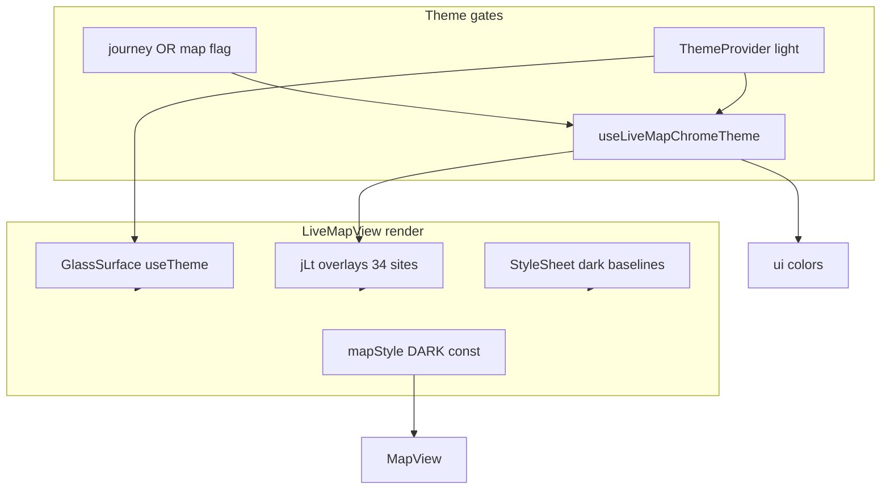

# WHITE-LIVEMAP-1A — LiveMap Theme Analysis

**Sprint:** WHITE-LIVEMAP-1A  
**Mode:** Read-only  
**Primary files:** `LiveMapView.tsx`, `useJourneyTheme.ts`, `app/index.tsx`, `design-system/primitives/GlassSurface.tsx`

---

## 1. How bound is LiveMapView to White Theme?

### Gate chain

```
ThemeProvider.resolvedTheme === 'light'
  AND (isLightThemeScreenEnabled('journey') OR isLightThemeScreenEnabled('map'))
    → useLiveMapChromeTheme().isScopeLight === true
      → jLt = buildJourneyChromeLightSurfaces(tokens)
      → ui = buildJourneyUi(tokens)  // not JOURNEY_UI_DARK
```

Hook definition: `frontend/lib/theme/useJourneyTheme.ts` lines 268–296.

### Binding depth: **partial (~35%)**

| Layer | White-theme aware? | Mechanism |
|-------|-------------------|-----------|
| `GlassSurface` shells | ✅ Yes | `useTheme()` → `LIGHT_GLASS_SURFACE_PRESETS` |
| `jLt` chrome overlays | ✅ Partial | 34 call sites; bg/border only on named surfaces |
| `ui` color object | ✅ Partial | dots, icons, gradients, loading text |
| `StyleSheet.create` baselines | ❌ No | ~103 `rgba` / `PREMIUM_*` literals; always applied first |
| Google Maps tiles | ❌ No | Fixed `mapStyle` const |
| Polylines / nav strokes | ❌ No | Hardcoded cyan `#22D3EE` / `rgba(34,211,238,*)` |
| Map markers | ❌ No | PNG / `mapMarkerChrome` dark-tuned |

`LiveMapView` destructures `{ chromeSurfaces: jLt, ui }` only — **`isScopeLight` is never read in the component**, so there is no conditional render path for map style or typography.

Prior audit alignment: `design-lab/ux-fixes/white-theme-release/03_SCREEN_COVERAGE.md` — “Chrome overlays light; map/markers/polylines dark.”

---

## 2. Which cards use hardcoded dark/light opacity?

### Top journey card (passenger `paxTopRouteShell` / driver `drvTopRouteShell`)

| Element | Baseline StyleSheet | `jLt` override | Hardcoded opacity/color |
|---------|--------------------|----------------|-------------------------|
| Route shell | layout + elevation | `topRouteShell` → `glassMuted` | — |
| Phase chip | `rgba(5,11,24,0.55)` | `topPhaseChipShell` → `glass` | dark semi-transparent base |
| Live chip | `rgba(5,11,24,0.55)` | `topLiveChipShell` | dot `rgba(34,211,238,0.68)` |
| Price chip | `rgba(5,11,24,0.55)` | `matchedTopPriceChip` | text `rgba(186,230,253,0.95)` |
| Near chip | `rgba(5,11,24,0.55)` | `matchedTopNearChip` | text `rgba(186,230,253,0.92)` |
| Route line text | — | — | **`rgba(243,248,255,0.92)`** |
| Status chip (`paxTopStatusChip`) | — | `drvTopStatusChip` | `PremiumText muted` (token OK if not overridden) |

### Bottom action panel (`paxBottomDeckShell` / `drvBottomDeckShell`)

| Element | Baseline | `jLt` | Notes |
|---------|----------|-------|-------|
| Deck shell | elevation only | `paxBottomDeckShell` / `drvBottomDeckShell` | GlassSurface `variant="panel"` supplies light bg |
| Call FAB | `rgba(16,26,43,0.88)` | **none** | stays dark navy circle |
| Chat button | `rgba(16,26,43,0.87)` | **none** | dark navy pill |
| Güven AL button | `rgba(16,26,43,0.92)` | **none** | dark navy |
| QR primary | `rgba(16,26,43,0.9)` | `paxBottomQrBtnBoarding/TripEnd` | bg → light `glassMuted`; border tokenized |
| Force end / danger | `rgba(127,29,29,0.22)` | **none** | text `rgba(252,165,165,0.92)` |
| AI orb (if shown) | `rgba(16,26,43,0.9)` | **none** | — |

### Ancillary overlays

| Surface | Hardcoded |
|---------|-----------|
| `mapLoadingOverlay` | `rgba(8,17,31,0.42)` (+ `jLt.mapLoadingOverlay`) |
| `trustedAddCompactChip` | `rgba(16,26,43,0.94)` (+ partial `jLt`) |
| `navManeuverBanner` | dark baseline + `jLt.navManeuverBanner` |
| Driver Yolcuya Git chip | border `#1E3A5F`, label light text |

**Pattern:** Inner chips use **`rgba(5,11,24,0.55)`** (55% dark navy). On light theme, `jLt` replaces `backgroundColor` but **does not clear** stacked opacity feel when map shows through outer glass.

---

## 3. Why does the map stay dark on White Theme?

```8421:8451:frontend/components/LiveMapView.tsx
// Premium dark cockpit — Apple/Uber Black zemin; cyan rota kontrastı korunur; traffic layer açık kalır
const mapStyle = [
  { featureType: 'landscape', elementType: 'geometry', stylers: [{ color: '#101A2B' }] },
  // ... ~28 more dark rules ...
];
```

```6562:6562:frontend/components/LiveMapView.tsx
          customMapStyle={mapStyle}
```

**Root causes:**

1. `mapStyle` is a **module-level constant** — not derived from theme hook.
2. No `LIGHT_MAP_STYLE` (or `undefined` / Google default) branch anywhere in `frontend/**`.
3. Comment documents intentional dark cockpit for **cyan route contrast** and traffic layer.
4. `semanticTokens.map` defines light `overlay` / `chrome` tokens but **nothing consumes them for `customMapStyle`**.

Result: user selects Gündüz → light cards float over **Uber-black map tiles** → maximum visual clash and transparency bleed.

---

## 4. Style provenance — status card, journey card, action panel

### Passenger matched journey (primary bug surface)

```
topInfoPanel
├── renderTrustedAddCompactChip()     → styles.trustedAddCompact* + jLt?.trustedAdd*
└── GlassSurface variant="header"     → useTheme() light header preset
    style=[paxTopRouteShell, jLt?.topRouteShell]
    ├── Phase / Live / Price chips      → GlassSurface plain + dark baselines + jLt chip keys
    ├── Route lines                     → styles.matchedTopRouteLineText (hardcoded light text)
    ├── Near chip                       → jLt?.matchedTopNearChip
    ├── paxTopStatusChip                → jLt?.drvTopStatusChip
    └── paxTopLiveHintShell             → GlassSurface plain (no jLt)

paxBottomDeckShell
└── GlassSurface variant="panel"        → useTheme() light panel preset
    style=[paxBottomDeckShell, jLt?.paxBottomDeckShell]
    ├── Comm row (call / chat / güven)  → styles.paxBottom* only (dark baselines)
    └── paxBottomMainActions            → QR + force-end TouchableOpacity styles
```

### Driver matched journey

Same top pattern with `drvTopRouteShell`, `drvBottomDeckShell`, plus driver nav chip (`LinearGradient` + `ui.ctaGradient`).

### index.tsx trip banners (pre/full-screen map context)

```
useJourneyBannerTheme()  // alias of useLiveMapChromeTheme()
→ GlassSurface + styles.passengerTripBanner* + jLt?.tripBanner*
```

Banners share hook with LiveMap but live in **`index.tsx` StyleSheet** — same hardcoded text risk on banner-specific styles not patched by `jLt`.

---

## 5. Why text looks washed out

### Cause A — hardcoded light text on now-light surfaces

`matchedTopRouteLineText`, `paxTopLiveChipText`, `matchedTopPriceChipText`, `paxTopNearChipText`, `driverYolcuyaGitChipLabel`, etc. force **#F3F8FF-family colors**. Designed for dark navy cards; on white/light-gray glass they become **low-contrast pastels**.

`PremiumText` would supply `tokens.text.primary` (`rgba(13,17,23,0.92)`) when no `style.color` override — but StyleSheet overrides win.

### Cause B — `ui.ctaIcon` inverse on light buttons

```202:211:frontend/lib/theme/useJourneyTheme.ts
    ctaIcon: tokens.text.inverse,  // light theme: #F5F7FA
```

Used for call/chat/güven/QR Ionicons. QR button background becomes light via `jLt` → **white icon on light gray** ≈ invisible.

### Cause C — glass transparency over dark map

Light semantic tokens:

- `bg.glass`: `rgba(255,255,255,0.72)`
- `bg.glassMuted`: `rgba(238,242,247,0.88)`

Dark map visible through panel → perceived contrast drops; labels read “foggy.”

### Cause D — intentional state opacity (not theme bugs, but adds to “soluk”)

- `boardingConfirmed && { opacity: 0.45 }` on chat/güven/call
- `trustRequestPending && { opacity: 0.78 }`
- Navigation stage dimming `opacity: 0.42`

These are **logic-driven** and should remain; they compound theme contrast issues.

### Cause E — muted PremiumText on light

`tokens.text.muted` = `#64748B` — correct for light theme but paired with wrong fg/bg looks “disabled” on journey card matrix lines.

---

## 6. QR / chat / trust — styling vs logic boundary

| Control | Logic (do not touch) | Style source today |
|---------|---------------------|-------------------|
| QR primary | `handlePrimaryTripQrPress()` | `styles.paxBottomQrBtn*` + `jLt?.paxBottomQrBtn*` + `ui.ctaIcon` |
| Chat | `onChat()` callback + boarding guard alert | `styles.paxBottomChatBtn` dark baseline |
| Güven AL | `onTrustRequest` / `trustRequestAction` + pending disabled | `styles.paxBottomGuvenBtn` dark baseline |
| Trusted invite chip | `useTrustedCounterpartyStatus` + `performTrustedPrimaryAction` | `styles.trustedAddCompact*` + partial `jLt` |
| QR modals | Separate components | `useQrPaymentTrustTheme('qr'|'payment')` — already light-capable |

**Conclusion:** Polish is **style-only**; handlers, guards, socket, and modal open paths unchanged.

---

## Architecture diagram (current hybrid)



**LIVEMAP THEME ANALYSIS COMPLETE.**
