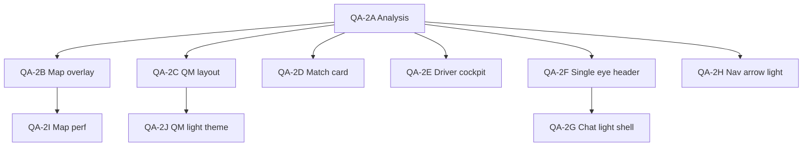

# 08 — Patch Order (WHITE-RELEASE-QA-2)

Recommended implementation sequence for device findings. Each item is a **separate small sprint** — style/layout/perf UX only unless noted.

---

## Phase 0 — QA baseline (no code)

Capture screenshots on 360×640, 390×844, 430×932 — light + dark — for all six findings before any patch.

---

## Phase 1 — P0 perceived blockers

| Sprint | Finding | Scope | Files (primary) | Est. risk |
|--------|---------|-------|-----------------|-----------|
| **QA-2B** | #5 Map loading | Overlay stack reduction; QM optimistic tag | `index.tsx`, `TagMatchTransitionOverlay.tsx`, `useQuickMatchDriverSession.ts` | Medium — test accept flows |
| **QA-2C** | #2 Quick Match layout | Sticky footer + compact route card | `QuickMatchPassengerFlow.tsx`, `usePassengerTheme.ts` | Low |

**Rationale:** Map blank/slow and QM CTA below fold are highest user friction on real devices.

---

## Phase 2 — P1 White readability

| Sprint | Finding | Scope | Files (primary) | Est. risk |
|--------|---------|-------|-----------------|-----------|
| **QA-2D** | #1 Match card | Solo width + trusted light tokens + CTA pill | `PassengerMatchModeCards.tsx`, `usePassengerTheme.ts` | Low |
| **QA-2E** | #3 Driver cockpit | Field intel + empty state light surfaces | `DriverOfferScreen.tsx`, `useDriverTheme.ts` | Low |
| **QA-2F** | #4 Leylek eye (header + FAB) | Replace PNG triggers with LeylekEye | `index.tsx`, `LeylekZekaWidget.tsx`, deprecate `LeylekEyeTrigger.tsx` | Low–medium |
| **QA-2G** | #4 Chat shell light | AI Kontrol Merkezi + speech toggle clarity | `LeylekZekaChat.tsx` | Medium — many sub-styles |

---

## Phase 3 — P2 polish

| Sprint | Finding | Scope | Files (primary) | Est. risk |
|--------|---------|-------|-----------------|-----------|
| **QA-2H** | #6 Nav arrow light | `DriverNavDirectionPointer` light branch | `LiveMapView.tsx` | Low — nav overlay only |
| **QA-2I** | #5 Map perf follow-up | tracksViewChanges, traffic defer, OSRM defer | `LiveMapView.tsx` | Medium — Android QA |
| **QA-2J** | #2 QM light theme | Contribution card + stepper qmLt | `QuickMatchPassengerFlow.tsx`, `usePassengerTheme.ts` | Low |

---

## Phase 4 — Optional / P3

- Match guardian slot: wire eye or reduce reserved height (`index.tsx:13360`)
- `trustedPassengerCount` wiring for Yolcularım copy
- Map prefetch during driver offer (`DriverOfferScreen.tsx`)
- Passenger map loading fallback parity
- GMS guard on `LiveMapView`

---

## Dependency graph



**Parallel safe:** QA-2D + QA-2E + QA-2C (no file overlap)  
**Sequential:** QA-2F before QA-2G; QA-2C before QA-2J; QA-2B before QA-2I

---

## Commit message templates

```
fix(theme): widen solo match card and light trusted tokens
fix(ui): quick match sticky footer and compact route card
fix(theme): driver field intelligence light readability
fix(ux): unify LeylekEye in driver header and chat
perf(map): reduce post-match overlay stack and QM tag latency
fix(theme): light navigation direction pointer chrome
```

---

## Release gate

All Phase 1–2 sprints complete + APK matrix from `01_DEVICE_FINDINGS.md` green before White theme release tag.
